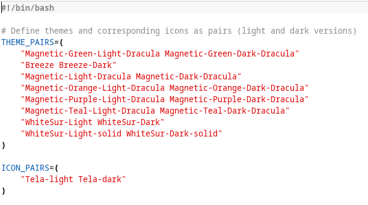

# 🎨 Xfce4-Dark-mode
bash script to toogle between dark and light theme on xfce4-desktop


# EDIT THEMES AND ICONS ACCODRING TO YOUR THEME ,ALTERNATE ✨LIGHT AND 🌙DARK


# 🚀 RUN
```
chmod +x ./darkmode.sh
```
```
./darkmode.sh
```
# 🖼️ themes used the script is in release section

# 💬 To install theme
  
  **Extract and copy themes to ~/.themes folder in your home directory
            amd copy icons to ~/.icons folder in your home directory**

  
  
